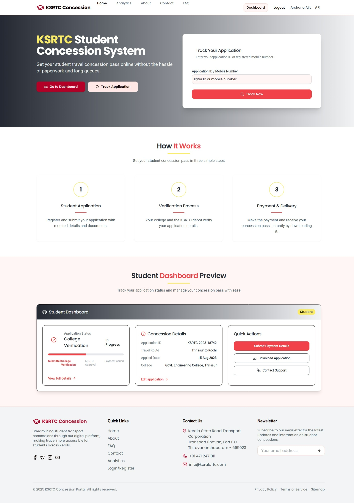
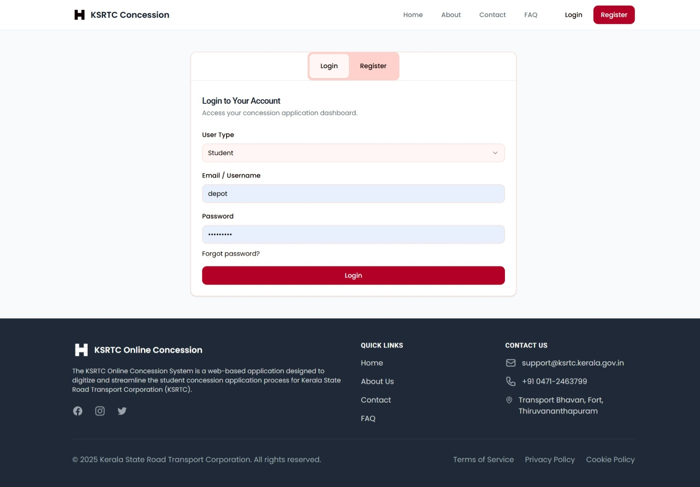
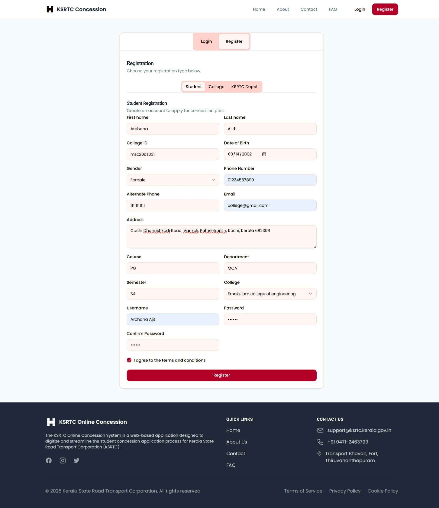
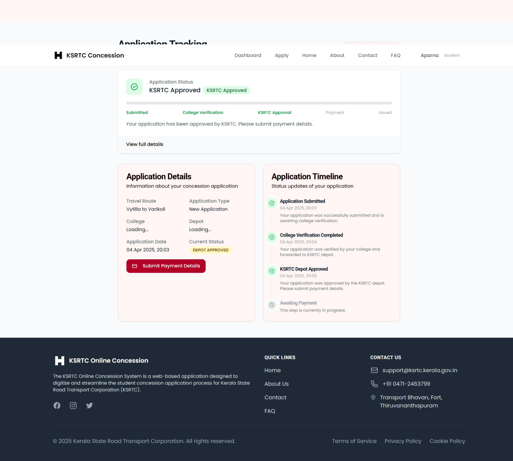
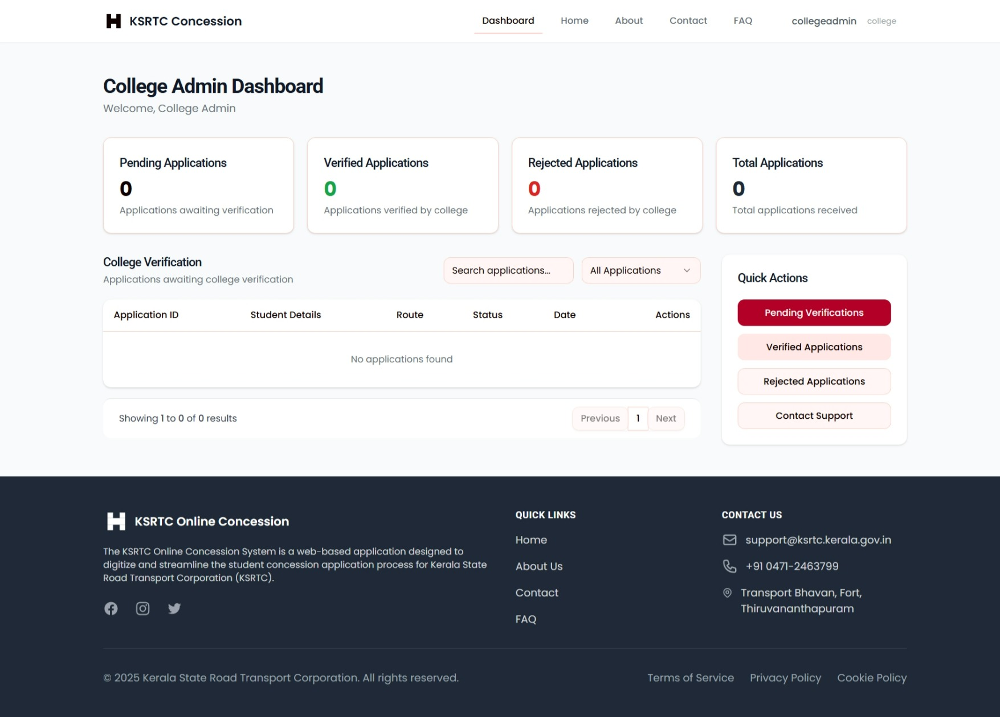
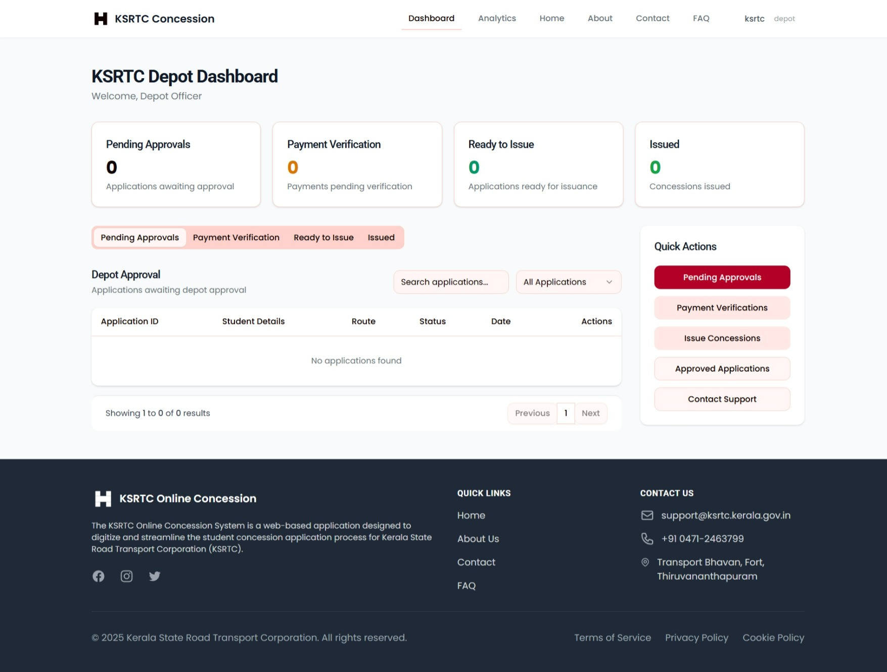

# KSRTC Online Concession System

A comprehensive web application for Kerala State Road Transport Corporation's student concession application process, enabling digital submission and tracking of transportation subsidy requests.

## Screenshots
### Home


### Login Pages




### College Admin Portal


### Depot Official Portal



## Project Structure

## Features

- Multi-role access for students, college administrators, and depot officials
- Digital document submission and verification
- Application tracking
- Payment processing
- Concession card issuance

## Technology Stack

- Frontend: React with TypeScript
- Backend: Node.js with Express
- Database: MongoDB (configurable)
- Authentication: Passport.js

## Database Setup

The application supports two storage options:

1. **In-Memory Storage**: Default for development and testing. Data is lost when the server restarts.
2. **MongoDB**: For production use. Requires MongoDB connection.

### Setting up MongoDB

1. Make sure you have MongoDB installed locally or have a MongoDB Atlas account
2. Run the MongoDB setup script: `bash scripts/setup-mongodb.sh`
3. Enter your MongoDB connection URI when prompted
4. Restart the server

### Reverting to In-Memory Storage

To switch back to the in-memory storage:

1. Run: `bash scripts/use-memory-storage.sh`
2. Restart the server

## Development

To start the development server:

```bash
npm run dev
```

This starts both the backend and frontend servers concurrently.

## Project Structure

- `/client`: React frontend application
  - `/src/components`: Reusable UI components
  - `/src/pages`: Page components
  - `/src/hooks`: Custom React hooks
  - `/src/lib`: Utility functions
- `/server`: Node.js backend
  - `/db`: Database models and connection
  - `/routes.ts`: API routes
  - `/storage.ts`: Data storage interface
  - `/auth.ts`: Authentication setup
- `/shared`: Shared types and schemas
- `/scripts`: Utility scripts

## Authentication

The application uses role-based authentication with three user types:
- Student
- College Administrator
- Depot Official

Each role has specific permissions and access to different parts of the application.
